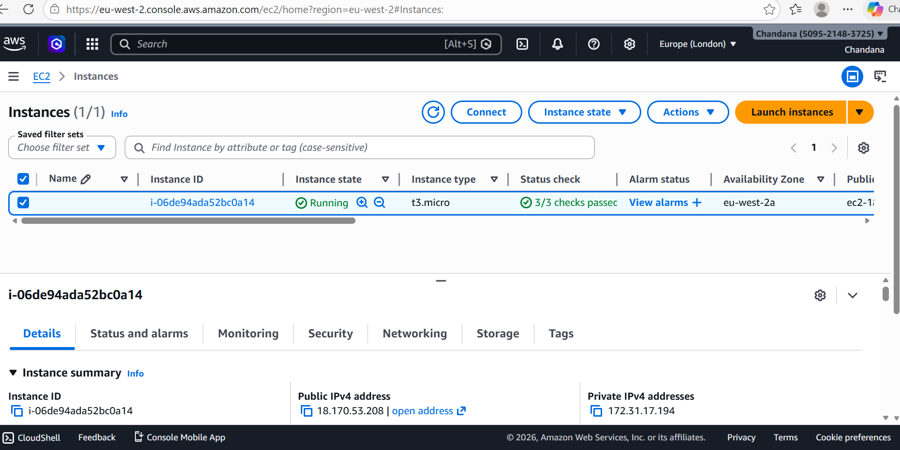
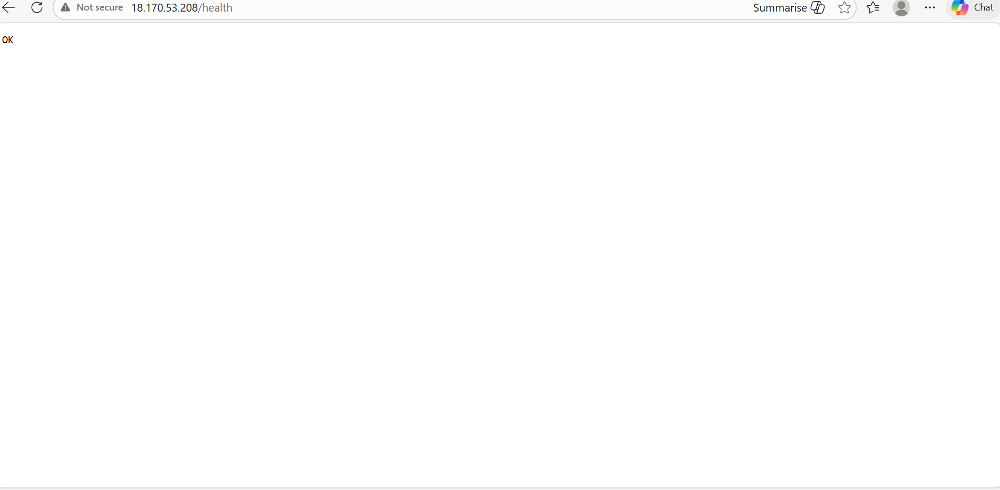
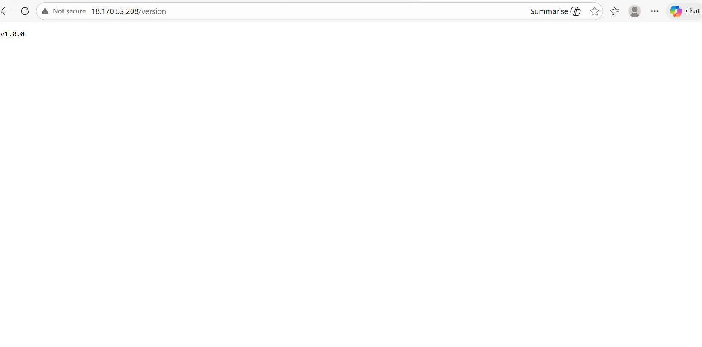
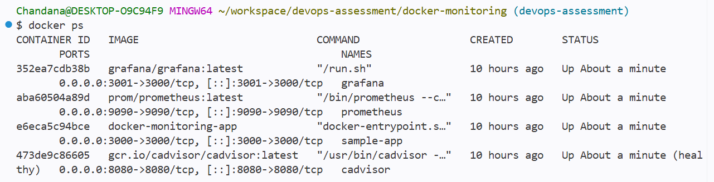
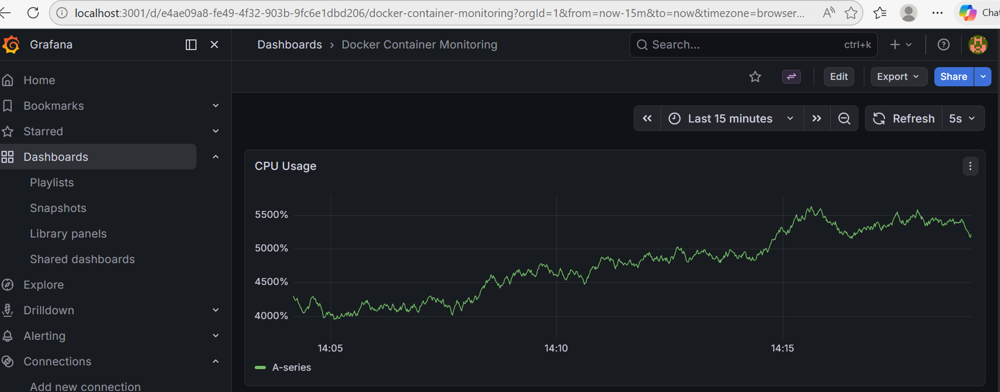
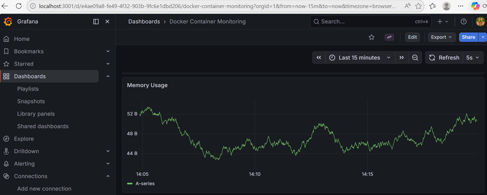
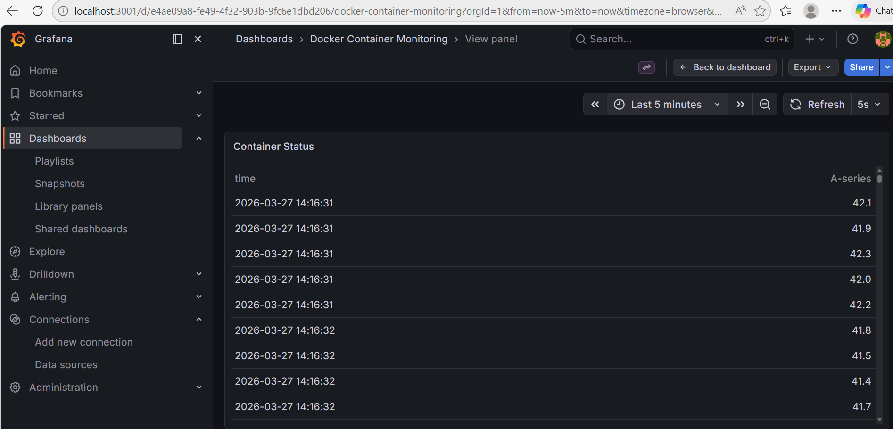

#  DevOps Assessment – Spectrum Life

> **Author:** Sai Chandana  
> **Role Applied For:** DevOps Engineer  
> **Submitted:** March 2026

---

## Table of Contents

- [Overview](#overview)
- [Repository Structure](#repository-structure)
- [Objective 1 – AWS Deployment with Terraform](#objective-1--aws-deployment-with-terraform)
  - [Architecture](#architecture)
  - [Prerequisites](#prerequisites)
  - [Quick Start](#quick-start)
  - [Configuration Reference](#configuration-reference)
  - [Endpoints](#endpoints)
  - [Teardown](#teardown)
- [Objective 2 – Docker + Monitoring Stack](#objective-2--docker--monitoring-stack)
  - [Architecture](#architecture-1)
  - [Prerequisites](#prerequisites-1)
  - [Quick Start](#quick-start-1)
  - [Accessing Services](#accessing-services)
  - [Grafana Dashboard](#grafana-dashboard)
  - [Teardown](#teardown-1)
- [Design Decisions](#design-decisions)
- [Troubleshooting](#troubleshooting)

---

## Overview

This repository contains the completed DevOps technical assessment consisting of two objectives:

| Objective | Description | Stack |
|-----------|-------------|-------|
| **1** | Provision and expose an EC2 instance via a public HTTP endpoint | Terraform, AWS EC2, Nginx |
| **2** | Containerise an application and visualise container metrics | Docker, Prometheus, cAdvisor, Grafana |

---

## Repository Structure

```
devops-assessment/
│
├── terraform/                        # Objective 1 – Infrastructure as Code
│   ├── main.tf                       # Root module main.tf
│   ├── variables.tf                  # Input variables definitions
│   ├── outputs.tf                    # EC2 public IP output
│   ├── .gitignore                    # Excludes tfstate, credentials
│   └── modules/
│       └── ec2/                      # Reusable EC2 module
│           ├── main.tf               # AMI pulling, Security Group, EC2 instance
│           ├── variables.tf          # Module-level variable definitions
│           ├── outputs.tf            # Exposes public IP
│           └── userdata.sh           # Nginx install + endpoint configuration
│
└── docker-monitoring/                # Objective 2 – Containerised App + Monitoring
    ├── docker-compose.yml            # Defining all 4 services
    ├── .env                          # Port config (environment variables)
    ├── app/
    │   ├── server.js                 # Express.js app with /health and /load endpoints
    │   ├── Dockerfile                # Multi-layer Alpine image
    │   └── package.json              # Dependencies
    ├── prometheus/
    │   └── prometheus.yml            # Scrape config with cAdvisor target
    ├── grafana/
    │   ├── datasource.yml            # declaring Prometheus as data source
    │   ├── dashboard.yml             # providing dashboard 
    │   └── docker-dashboard.json     # in-built dashboard with CPU, Memory, container Status
    └── scripts/
        ├── start.sh                  # docker-compose up -d --build for reference
        └── stop.sh                   # docker-compose down for reference
```

---

## Objective 1 – AWS Deployment with Terraform

### Architecture

```
Internet
    │
    ▼
┌─────────────────────────────────┐
│         AWS (eu-west-2)         │
│                                 │
│  ┌──────────────────────────┐   │
│  │      Security Group      │   │
│  │   Port 80  (HTTP)        │   │
│  │   Port 22  (SSH)         │   │
│  │   All outbound traffic   │   │
│  └──────────┬───────────────┘   │
│             │                   │
│  ┌──────────▼───────────────┐   │
│  │   EC2 – t3.micro         │   │
│  │   Amazon Linux 2         │   │
│  │   Nginx (via user-data)  │   │
│  │                          │   │
│  │  GET /         → 200     │   │
│  │  GET /health   → 200 OK  │   │
│  │  GET /version  → v1.0.0  │   │
│  └──────────────────────────┘   │
└─────────────────────────────────┘
```

### Prerequisites

| Requirement | Version |
|-------------|---------|
| Terraform   | ≥ 1.0   |
| AWS CLI | ≥ 2.0       |
| AWS Account | Free tier |

Configure AWS credentials:
```bash
aws configure
# Enter: Access Key ID, Secret Access Key, Region (eu-west-2), Output format (json)
```

### Quick Start

```bash
# 1. Clone the repository
git clone <your-repo-url>
cd devops-assessment/terraform

# 2. Initialise Terraform
terraform init

# 3. validate terraform's plan 
terraform plan

# 4. Deploy infrastructure
terraform apply
# Type 'yes' when prompted

# 5. Note the output
# public_ip = "x.x.x.x"
```

> Please **Wait 1–2 minutes** once the terraform apply is finished to make room for the user-data script to finish installing and configuring Nginx.

### Configuration Reference

All variables include validation rules. Defaults are production-safe.

| Variable | Default | Allowed Values | Description |
|----------|---------|----------------|-------------|
| `region` | `eu-west-2` | `eu-west-2`, `us-east-1`, `us-west-2` | AWS deployment region |
| `instance_type` | `t3.micro` | `t2.micro`, `t3.micro` | EC2 instance size |
| `project_name` | `spectrum-life` | Any string | Tag applied to all resources |
| `allowed_http_cidr` | `0.0.0.0/0` | Any valid CIDR | IP range allowed on port 80 |
| `allowed_ssh_cidr` | `0.0.0.0/0` | Any valid CIDR | IP range allowed on port 22 |
| `key_name` | `null` | Any key pair name | SSH key access is optional|

To override defaults:
```bash
terraform apply \
  -var="region=us-east-1" \
  -var="instance_type=t2.micro" \
  -var="allowed_ssh_cidr=203.0.113.0/24"
```

### Endpoints

Replace `<public_ip>` with the IP from Terraform output.

| Endpoint | Method | Expected Response | Status |
|----------|--------|-------------------|--------|
| `http://<public_ip>/` | GET | `Chandana DevOps Assessment Running` | 200 |
| `http://<public_ip>/health` | GET | `OK` | 200 |
| `http://<public_ip>/version` | GET | `v1.0.0` | 200 |

### How to destroy

```bash
terraform destroy
# Type 'yes' when prompted
```

---

## Objective 2 – Docker + Monitoring Stack

### Architecture

```
┌─────────────────────────────────────────────────────┐
│                   Docker Network                    │
│                                                     │
│  ┌──────────────┐      ┌──────────────────────┐     │
│  │  sample-app  │      │      cAdvisor        │     │
│  │  Node/Express│      │  Container Metrics   │     │
│  │  :3000       │      │  :8080               │     │
│  └──────────────┘      └──────────┬───────────┘     │
│                                   │ scrapes         │
│                         ┌──────────▼───────────┐    │
│                         │      Prometheus      │    │
│                         │  Metrics Storage     │    │
│                         │  :9090               │    │
│                         └──────────┬───────────┘    │
│                                    │ queries        │
│                         ┌──────────▼───────────┐    │
│                         │       Grafana        │    │
│                         │  Dashboards & Alerts │    │
│                         │  :3001               │    │
│                         └──────────────────────┘    │
└─────────────────────────────────────────────────────┘
```

### Prerequisites

| Requirement | Notes |
|-------------|-------|
| Docker Engine | [Install guide](https://docs.docker.com/get-docker/) |
| Docker Compose | Included with Docker Desktop |

### Quick Start

```bash
# 1. Navigate to docker-monitoring
cd devops-assessment/docker-monitoring

# 2. Run the start script
bash scripts/start.sh

# OR manually:
docker-compose up -d --build

# 3. Verify all containers are running
docker ps
```

### Accessing Services

| Service | URL | Credentials | Purpose |
|---------|-----|-------------|---------|
| **Application** | http://localhost:3000 | – | Node.js Express app |
| **cAdvisor** | http://localhost:8080 | – | Raw container metrics |
| **Prometheus** | http://localhost:9090 | – | Metrics query interface |
| **Grafana** | http://localhost:3001 | `admin` / `admin` | Visualisation dashboard |

### Grafana Dashboard

The dashboard is **pre-provisioned automatically** — no manual setup required.

1. Open **http://localhost:3001**
2. Log in with `admin` / `admin`
3. Navigate to **Dashboards → Docker Monitoring**
4. The dashboard displays:
   -  **CPU Usage** – per container CPU consumption over time
   -  **Memory Usage** – per container memory consumption over time
   -  **Container Status** – running state of all containers

>  **Note:** Hit `http://localhost:3000/load` a few times to generate CPU activity and watch the Grafana graphs update in real time.

### teardown

```bash
bash scripts/stop.sh

# OR manually run:
docker-compose down
```

---

## Keypoints

### objective1 - keypoints

- The `ec2` module is fully reusable, any project can import it with different variable values. Root module handles project-specific configuration only.
- I have included validations in variable definitions to prevent accidental deployment to unsupported regions or instance types.
- Using `data "aws_ami"` block ensures the latest patched Amazon Linux 2 AMI is always used rather than a hardcoded, potentially outdated AMI.
- Fully automated provisioning, no manual SSH required after `terraform apply`.

### objective2 - keypoints

- The chosen node 18 alpine image is significantly smaller than the standard Node image, image pull time, and storage cost.
- .env centralises all port config. Engineers can change ports without touching `docker-compose.yml`.
- Datasources and dashboards are provisioned via mounted config files — no manual intervention required after startup. Fully reproducible.
- Provides near-real-time metrics in Grafana without excessive storage overhead.

---

## Screenshots

- [ ] EC2 instance running in AWS Console


- [ ] `/health` endpoint accessible in browser

- [ ] `/version` endpoint accessible in browser

- [ ] All 4 Docker containers running (`docker ps`)

- [ ] Grafana dashboard showing live CPU and memory metrics



---

